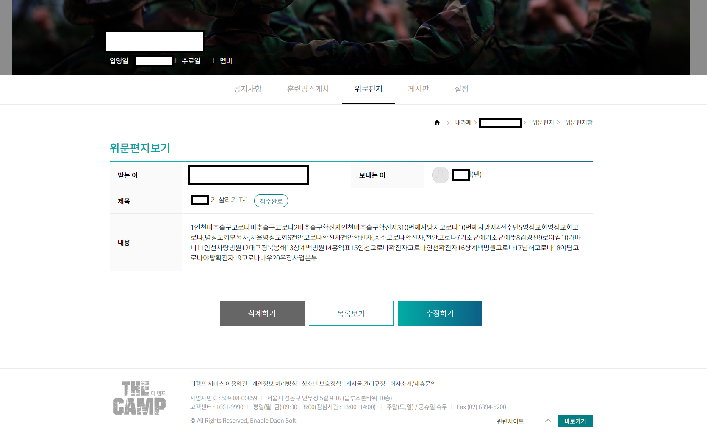

# The-Camp-Letter
훈련소 입대를 한 그 친구를 위하여 오늘 난 위문편지 매크로를 짠다

> Cloud scheduler 가 매일 6시간에 한번씩 편지 API 를 호출함
>
> 네이버의 실시간 검색 순위를 크롤링 해온다음 편지를 작성함

## DEMO



## Set up

1. Check the trainee mgr seq from [here](https://www.thecamp.or.kr/consolLetter/viewConsolLetterMain.do)
2. Config firebase env
```
firebase functions:config:set thecamp.trainee_mgr_seq=""
firebase functions:config:set thecamp.trainee_name=""
```
3. Save env as file
```
firebase functions:config:get > .runtimeconfig.json
```